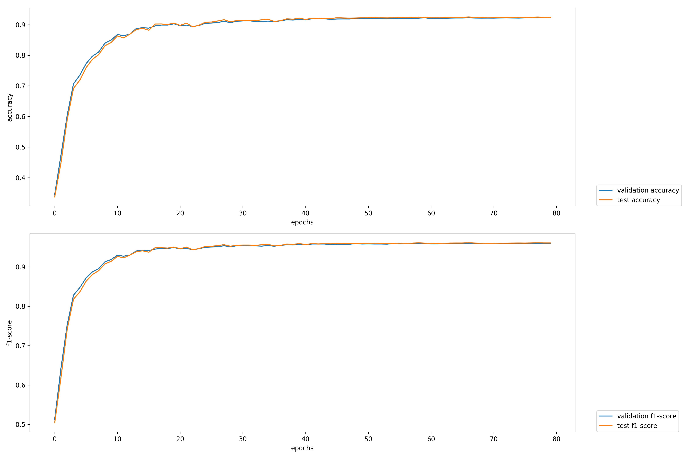
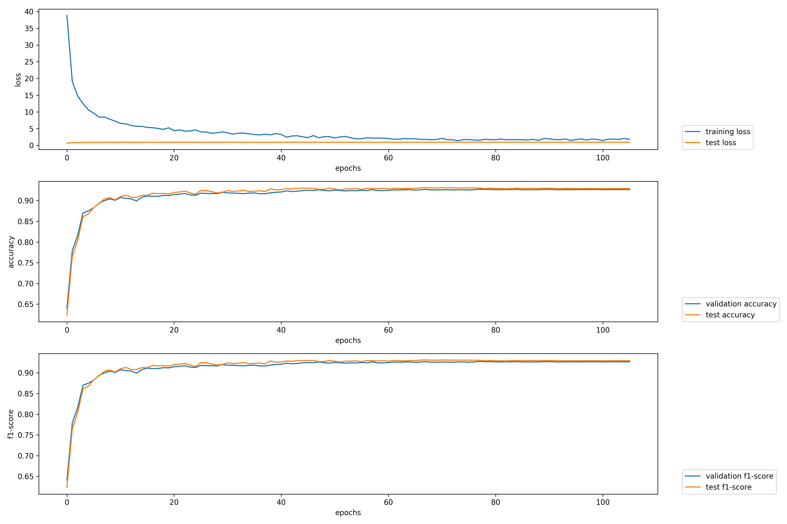

# Fine-grained POS Tagging of German Tweets

Abstract of the [Fine-grained POS Tagging of German Tweets](https://pdfs.semanticscholar.org/82c9/90aa15e2e35de8294b4a721785da1ede20d0.pdf)
paper from Ines Rehbein:

> This paper presents the first work on POS tagging German Twitter data, showing
> that despite the noisy and often cryptic nature of the data a fine-grained
> analysis of POS tags on Twitter microtext is feasible. Our CRF-based tagger
> achieves an accuracy of around 89% when trained on LDA word clusters, features
> from an automatically created dictionary and additional out-of-domain training
> data.

Now a model is trained, which achieves a new state-of-the-art result for the
Twitter test set 😎

## Data

The data set can be obtained from Ines Rehbein. Just use the email adresse
in the paper. She is very friendly and helpful!

The data comes in an archive `twitter_gold.tgz`. Just copy it into the
`pos-twitter-german` located in this repository. Then untar it with:

```bash
tar -xzf twitter_gold.tgz
```

Change to the extracted folder `twitter_gold`:

```bash
cd twitter_gold
```

The following xml files are relevant for training, finetuning and testing the
model:

* `twitter.gold.train.xml`
* `twitter.gold.dev.xml`
* `twitter.gold.test.xml`

Thus, we need to convert these xml files into a `flair` compatible format.

## `flair`-compatible format

The `preprocess.py` script converts each xml file into a `flair` compatible
format (just a simple CoNLL tab-separated format):

```bash
python preprocess.py twitter_gold/twitter.gold.train.xml > train.txt
python preprocess.py twitter_gold/twitter.gold.dev.xml > dev.txt
python preprocess.py twitter_gold/twitter.gold.test.xml > test.txt
```

## Fine-tuning

We fine-tune a model with German word and Flair embeddings and perform a basic hyper-parameter search over
different batch sizes: `[4, 8, 16, 32]`.

Results on development (accuracy averaged over 5 runs) can be seen in the following table:

| Configuration | Run 1 | Run 2 | Run 3 | Run 4 | Run 5 | Avg.         |
|---------------|-------|-------|-------|-------|-------|--------------|
| `bs4`         | 92.84 | 92.66 | 92.88 | 92.74 | 92.88 | 92.80 ± 0.09 |
| `bs8`         | 92.81 | 92.76 | 92.81 | 92.63 | 92.62 | 92.73 ± 0.08 |
| `bs16`        | 92.71 | 92.45 | 92.59 | 92.3  | 92.62 | 92.53 ± 0.14 |
| `bs32`        | 92.23 | 92.2  | 92.76 | 92.35 | 92.35 | 92.38 ± 0.20 |

Based on the best configuration (with batch size 4), the achieved test result is 92.84 ± 0.25.

| System                          | Final Accuracy |
|---------------------------------|----------------|
| Best reported accuracy in paper | 89.42          |
| Our model                       | 92.84 ± 0.25   |

The best model was then uploaded to the Hugging Face Model Hub:

* [`flair/de-pos-fine-grained`](https://huggingface.co/flair/de-pos-fine-grained)

and it can be loaded with:

```python
import flair
model = flair.models.SequenceTagger.load('de-pos-fine-grained')
```

## Old experiments

Initial experiments with Flair on that dataset were made a while ago.

<details>
<summary>Detailed summary can be found here:</summary>

## Training

### Experiment 1

For the first experiment we use the following parameters:

| Parameter              | Value
| ---------------------- | -----
| `flair`                | beffa4a32947d0a7a0afbb431bb65e201e4ac757 + own accuracy calculation fix
| `WordEmbeddings`       | `de-fasttext`
| `CharLMEmbeddings`     | `german-forward`
| `CharLMEmbeddings`     | `german-backward`
| `hidden_size`          | `256`
| `learning_rate`        | `0.1`
| `mini_batch_size`      | `32`
| `max_epochs`           | `150`

To reproduce the first experiment, just use the following training script:

```bash
python train_1.py
```

### Experiment 2

For the second experiment we use the following parameters:

| Parameter              | Value
| ---------------------- | -----
| `flair`                | 5b72a4491de637d49dbed19a9bd1a456da7df365
| `WordEmbeddings`       | `de-fasttext`
| `CharLMEmbeddings`     | `german-forward`
| `CharLMEmbeddings`     | `german-backward`
| `hidden_size`          | `256`
| `learning_rate`        | `0.2`
| `mini_batch_size`      | `8`
| `max_epochs`           | `150`
| `dropout`              | `0.28773163555776493`

These parameters were found after a hyper parameter search. In order to run
a hyper parameter search, just use the `hyperopt.py` script.

## Evaluation

There's no official evaluation script available. Thus, we measure the
accuracy by comparing each predicted tag in a sentence with the gold tag from
the test set.

This can be automatically done with the `predict.py` script:

```bash
python predict.py twitter_gold/twitter.gold.test.xml
```

# Results

## Task 1

### Experiment 1

For the first experiment the following result accuracy could be achieved:

```text
Accuracy: 0.9249629529839688
```

#### Plot

Accuracy and F1-score over epochs:



### Experiment 2

For the second experiment an accuracy of 93.06 could be achieved.

The model for experiment 2 can be downloaded from:

```bash
wget https://schweter.eu/cloud/flair-models/de-pos-twitter-v0.1.pt
```

That model was also included in `flair` 0.4, see [this](https://github.com/zalandoresearch/flair/issues/51)
issue. Thus, the model can be loaded with:

```python
from flair.models import SequenceTagger
tagger: SequenceTagger = SequenceTagger.load('de-pos-fine-grained')
```

#### Plot

Accuracy and F1-score over epochs:



## Overview

| System                          | Final Accuracy
| ------------------------------- | ---------------------------
| Best reported accuracy in paper | 89.42
| Experiment 1                    | 92.49
| Experiment 2                    | **93.06**

</details>