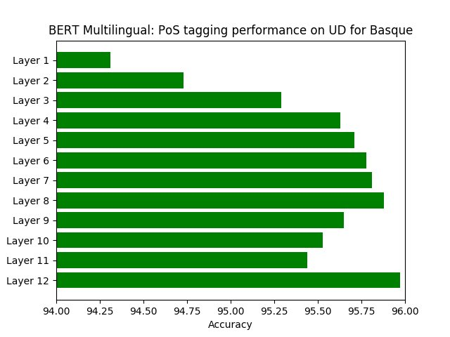

# Basque POS tagging: Universal dependencies

We use Basque UD for training a model with `flair`.

## Data

The train, dev and test datasets are used from:

<https://lindat.mff.cuni.cz/repository/xmlui/handle/11234/1-1548>

This is universal dependencies in version 1.2 which is mostly used in papers.


Thus, this data needs to be downloaded with:

```bash
curl --remote-name-all https://lindat.mff.cuni.cz/repository/xmlui/bitstream/handle/11234/1-1548{/ud-treebanks-v1.2.tgz}
```

Extract the downloaded archive with:

```bash
tar -xzf ud-treebanks-v1.2.tgz
```

## Word Embeddings

Pretrained `fasttext` word embeddings needs to be downloaded with:

```
https://s3-us-west-1.amazonaws.com/fasttext-vectors/wiki.eu.vec
```

## Language models

Forward and backward language models needs also to be downloaded with:

```
wget https://schweter.eu/cloud/flair-lms/lm-eu-large-forward-v0.1.pt
wget https://schweter.eu/cloud/flair-lms/lm-eu-large-backward-v0.1.pt
```

## `flair`-compatible format

`flair` already comes with an import for the universal dependencies format.

## Training

### Experiment 1

| Parameter              | Value
| ---------------------- | -----
| `flair`                | 5b72a4491de637d49dbed19a9bd1a456da7df365
| `WordEmbeddings`       | Pretrained Basque `fasttext` embeddings from [here](https://github.com/facebookresearch/fastText/blob/master/pretrained-vectors.md)
| `CharLMEmbeddings`     | Forward lm from [here](https://github.com/stefan-it/flair-lms#basque)
| `CharLMEmbeddings`     | Backward lm from [here](https://github.com/stefan-it/flair-lms#basque)
| `hidden_size`          | `256`
| `learning_rate`        | `0.1`
| `mini_batch_size`      | `8`
| `max_epochs`           | `500`

To reproduce the first experiment, just use the following training script:

```bash
python train_1.py
```

### BERT Multilingual Embeddings

| Parameter              | Value
| ---------------------- | -----
| `flair`                | bd1bc6306284c1c71781b503c244f5d3c9e29526
| `WordEmbeddings`       | Basque `fasttext` embeddings
| `BertEmbeddings`       | `bert-base-multilingual-cased`
| `hidden_size`          | `512`
| `learning_rate`        | `0.1`
| `mini_batch_size`      | `8`
| `max_epochs`           | `500`
| `use_crf`              | `False`

For the BERT multilingual embeddings experiment, a per-layer analysis
can be done using the following command:

```bash
python train_bert.py <layer>
```

## Evaluation

There's no official evaluation script available. Thus, we measure the
accuracy by comparing each predicted tag in a sentence with the gold tag from
the test set.

This can be automatically done with the `predict.py` script:

```bash
python predict.py universal-dependencies-1.2/UD_Basque/eu-ud-test.conllu
```

# Results

## Experiment 1

For the first experiment the following results could be achieved:

```bash
Accuracy: 0.9717
```

## BERT Multilingual Embeddings

For the BERT multilingual embeddings experiment, a per-layer analysis
was done:

| Layer    | Trained epochs | Duration | Test Accuracy
| -------- | -------------- | -------- | -------------
| Layer 1  | 148            | 1:25h    | 0.9431
| Layer 2  | 127            | 1:15h    | 0.9473
| Layer 3  | 136            | 1:20h    | 0.9529
| Layer 4  | 145            | 1:25h    | 0.9563
| Layer 5  | 113            | 1:06h    | 0.9571
| Layer 6  | 146            | 1:24h    | 0.9578
| Layer 7  | 137            | 1:19h    | 0.9581
| Layer 8  | 152            | 1:28h    | 0.9588
| Layer 9  | 150            | 1:27h    | 0.9566
| Layer 10 | 157            | 1:31h    | 0.9552
| Layer 11 | 147            | 1:25h    | 0.9544
| Layer 12 | 135            | 1:19h    | 0.9597



## Overview

| System                                                     | Final Accuracy
| ---------------------------------------------------------- | -------------
| [Yu et. al (2017)](https://arxiv.org/abs/1706.01723)       | 94.94
| [Plank et. al (2016)](https://arxiv.org/abs/1604.05529)    | 95.51
| [Yasunaga et. al (2017)](https://arxiv.org/abs/1711.04903) | 94.71
| Experiment 1                                               | **97.17**
| BERT Multilingual Embeddings (last layer)                  | 95.97
