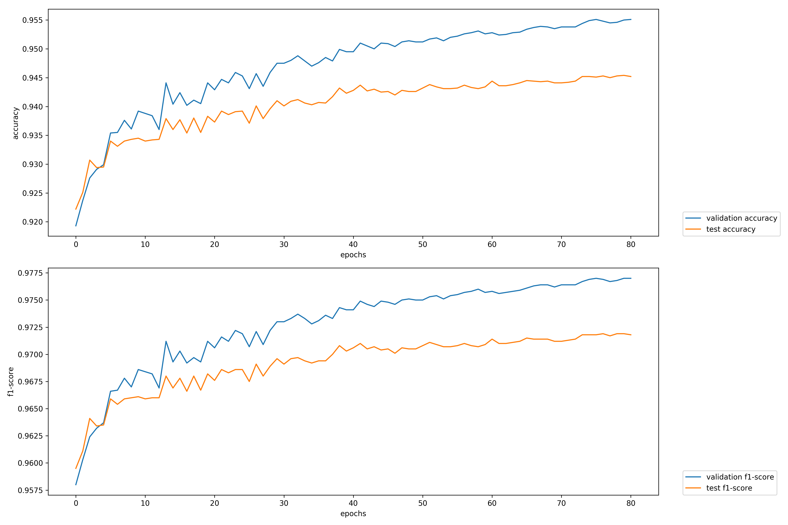

# German POS tagging: Universal dependencies

We use German UD for training a model with `flair`.

## Data

The train, dev and test datasets are used from:

<https://lindat.mff.cuni.cz/repository/xmlui/handle/11234/1-1548>

This is universal dependencies in version 1.2 which is mostly used in papers.


Thus, this data needs to be downloaded with:

```bash
curl --remote-name-all https://lindat.mff.cuni.cz/repository/xmlui/bitstream/handle/11234/1-1548{/ud-treebanks-v1.2.tgz}
```

Extract the downloaded archive with:

```bash
tar -xzf ud-treebanks-v1.2.tgz
```

## `flair`-compatible format

`flair` already comes with an import for the universal dependencies format.

## Training

### Experiment 1

| Parameter              | Value
| ---------------------- | -----
| `flair`                | beffa4a32947d0a7a0afbb431bb65e201e4ac757 + own accuracy calculation fix
| `WordEmbeddings`       | `de-fasttext`
| `CharLMEmbeddings`     | `german-forward`
| `CharLMEmbeddings`     | `german-backward`
| `hidden_size`          | `256`
| `learning_rate`        | `0.1`
| `mini_batch_size`      | `32`
| `max_epochs`           | `500`

To reproduce the first experiment, just use the following training script:

```bash
python train_1.py
```

## Evaluation

There's no official evaluation script available. Thus, we measure the
accuracy by comparing each predicted tag in a sentence with the gold tag from
the test set.

This can be automatically done with the `predict.py` script:

```bash
python predict.py universal-dependencies-1.2/UD_German/de-ud-test.conllu
```

# Results

## Experiment 1

For the first experiment the following results could be achieved:

```bash
Accuracy: 0.9452298991885911
```

### Plot

Accuracy and F1-score over epochs:



## Overview

| System                                                     | Final Accuracy
| ---------------------------------------------------------- | -------------
| [Yu et. al (2017)](https://arxiv.org/abs/1706.01723)       | 92.73
| [Plank et. al (2016)](https://arxiv.org/abs/1604.05529)    | 93.51
| [Yasunaga et. al (2017)](https://arxiv.org/abs/1711.04903) | 94.35
| Experiment 1                                               | **94.52**
